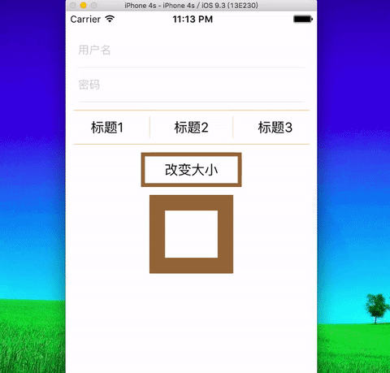

# MXBorder

## Installation

Add to your `Podfile`:

	pod 'MXBorder', '~> 0.1.0'
	
Run the following command:

	$ pod install

## Usage

#### singal border

	[self.nameField mx_showBorder:^(MXBorderMaker *maker) {
		maker.bottom.mxb_width(0.5).mxb_color([UIColor colorWithWhite:0 alpha:0.1]);
	}];
   	
#### border array

	[self.label1 mx_showBorder:^(MXBorderMaker *maker) {
		@[maker.top, maker.bottom].mxb_color([UIColor orangeColor]).mxb_width(0.25).mxb_start(10);
	}];
	
#### all border

    [self.label4 mx_showBorder:^(MXBorderMaker *maker) {
        maker.all.mxb_color([UIColor brownColor]).mxb_width(5);
    }];
    
#### attributes

    [self.label2 mx_showBorder:^(MXBorderMaker *maker) {
        maker.all.mxb_color([UIColor orangeColor]).mxb_width(0.25);
        maker.left.mxb_start(8).mxb_end(8);
        maker.right.mxb_start(8).mxb_end(8);
    }];
    
## License

MIT